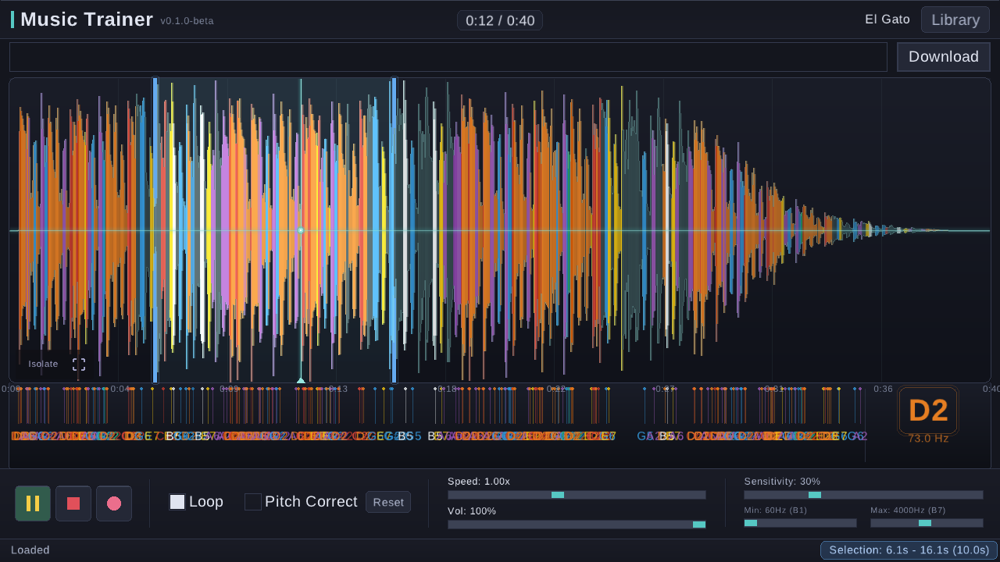
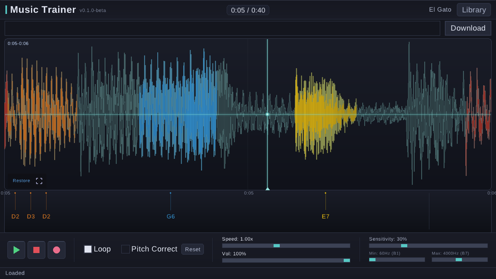
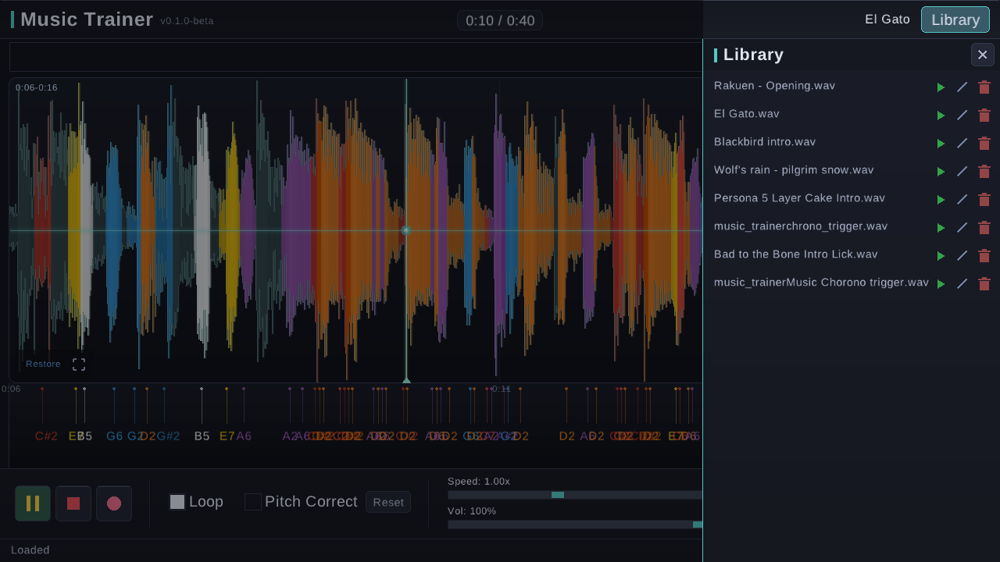

# Music Trainer

**v0.1.0-beta**

A desktop audio learning tool for practicing songs by ear. Load audio files, visualize the waveform with real-time pitch detection, loop sections, slow down with or without pitch correction, and isolate sections for focused practice.

Built with [Odin](https://odin-lang.org/) and [Raylib](https://www.raylib.com/).



## Screenshots

**Full view** — click and drag to select a region; it auto-loops on release. The waveform is color-coded by detected pitch, with a note timeline underneath.

**Isolated section** — zoom into any selection to practice it in detail. Isolations nest: each level gets its own view, loop region, and breadcrumb trail, and restoring unwinds one level at a time.



**Music library** — browse, preview, rename, and delete files in your library.



## Features

- **Waveform visualization** — color-coded by detected pitch (each note gets a distinct color)
- **Real-time note detection** — FFT-based pitch analysis with parabolic interpolation
- **Section looping** — click and drag to select a region, auto-loops on release
- **Section isolation** — zoom into a selection with the Isolate button; isolate again inside for nested zoom, with a breadcrumb trail (`0:00-0:02 > 0:01-0:02`) showing the levels
- **Pitch-corrected speed** — slow down to 0.25x (or up to 2.0x) without changing pitch, via time-stretching; or disable Pitch Correct for classic resampling
- **Speed control** — 0.25x to 2.0x playback
- **Detection filters** — adjust sensitivity, min/max frequency to isolate melody from accompaniment
- **Click to seek** — click anywhere on the waveform to jump to that position
- **Zoom and scroll** — Ctrl+wheel to zoom, wheel to scroll horizontally
- **Track title** — shown in the title bar and window title
- **URL download** — paste a URL and download audio via yt-dlp
- **System audio recording** — record audio playing from your system; on Linux it captures the default output's monitor channel, on macOS it captures the microphone or [BlackHole](https://github.com/ExistentialAudio/BlackHole) (see *Recording system audio on macOS* below). Click the chip next to the record button to switch capture devices
- **File library** — browse, preview, rename, and delete files in your library
- **Drag and drop** — drop audio files directly onto the window

## Prerequisites

- **Odin compiler** — [installation instructions](https://odin-lang.org/docs/install/)
- **Raylib** — included with Odin's vendor collection, no separate install needed
- **GNU Make** — for the build system
- **Liberation Sans font** — usually pre-installed on Linux (`/usr/share/fonts/truetype/liberation/`); on macOS the system Arial font is used

### Optional

- **yt-dlp** — for downloading audio from URLs (`pip install yt-dlp` or your package manager; on macOS `brew install yt-dlp`)
- **pactl** (Linux only) — lets the app pick the monitor of the *default* output sink when recording; without it the first monitor source is used. Included with `pulseaudio-utils` (also available through PipeWire's PulseAudio compatibility layer)
- **Node.js** — required by yt-dlp for some extractors

## Building

```sh
make build
```

The binary is output to `build/music_trainer`.

## Running

```sh
make run
```

Or run directly with an optional file argument:

```sh
./build/music_trainer [path/to/audio.wav]
```

## Usage

| Action | Input |
|---|---|
| Play / Pause | Space or Play button |
| Stop | Stop button |
| Seek | Click on waveform (left or right button) |
| Select section | Click and drag on waveform |
| Isolate selection | `Z` or Isolate button |
| Restore last isolation | `Z` or Escape or Restore button |
| Full view | `F` or full-view button |
| Zoom | Ctrl + mouse wheel |
| Scroll | Mouse wheel |
| Speed up / down | Up / Down arrow keys |
| Seek ±5s | Left / Right arrow keys |
| Record system audio | Record button (pink circle) |
| Load from library | Library button → click file |
| Preview in library | Play icon next to file |
| Rename file | Pencil icon next to file |
| Delete file | Trash icon next to file |

## Section Isolation

Select a region and hit **Isolate** (or `Z`) to zoom into it — the region loops on its own and the waveform is redrawn for that slice. Inside an isolated view you can:

- Make a new selection and it loops by itself
- Isolate again to nest deeper (each level is its own state)
- Watch the breadcrumb trail at the top-left of the waveform to see where you are

**Restore** (`Z` or Escape) unwinds one level, returning that level's view, selection, and loop settings. **Full view** (`F`) unwinds everything at once.

## Music Library

Audio files are stored in `~/Music/music_trainer/`. This directory is created automatically on first use. Downloaded files, recordings, and any files you want in the library should be placed here. The Library panel browses this folder and supports `.wav`, `.mp3`, `.flac`, and `.ogg` formats.

## Recording system audio on macOS

macOS doesn't expose a system-wide "what you hear" input. The free, open-source [BlackHole](https://github.com/ExistentialAudio/BlackHole) virtual audio driver provides one:

1. Install: `brew install blackhole-2ch`, then reboot (macOS loads audio drivers at boot)
2. Open **Audio MIDI Setup** → **+** → **Create Multi-Output Device**
3. Tick **BlackHole 2ch** and your real output device, keeping your real output listed first (clock source)
4. Set the Multi-Output Device as the system output (System Settings → Sound)
5. Start Music Trainer — the record chip auto-picks **BlackHole 2ch**; record as usual

The app is not notarized: on first launch, right-click it and choose **Open** (or `xattr -cr "/Applications/Music Trainer.app"`), then allow **Microphone** access when prompted.

## Releases

Prebuilt binaries are attached to [GitHub Releases](https://github.com/dantheobserver/music-trainer/releases):

- **Linux** — `Music-Trainer-x86_64.AppImage` (bundles its fonts; just `chmod +x` and run)
- **macOS** — `Music-Trainer-macOS.dmg` (universal binary, Apple Silicon + Intel). The app is not notarized — on first launch, right-click it and choose **Open**, or run `xattr -cr "/Applications/Music Trainer.app"`


## Keyboard Shortcuts

| Key | Action |
|---|---|
| `Space` | Toggle play/pause |
| `Left` / `Right` | Seek ±5 seconds |
| `Up` / `Down` | Adjust playback speed |
| `Z` | Isolate selection / restore last isolation |
| `F` | Full view (unwind all isolations) |
| `Escape` | Restore isolation, or clear selection |

## License

MIT — see [LICENSE](LICENSE).

---

*Made with Vibes. LLM Harness was used to manifest my ideas into this app.*
